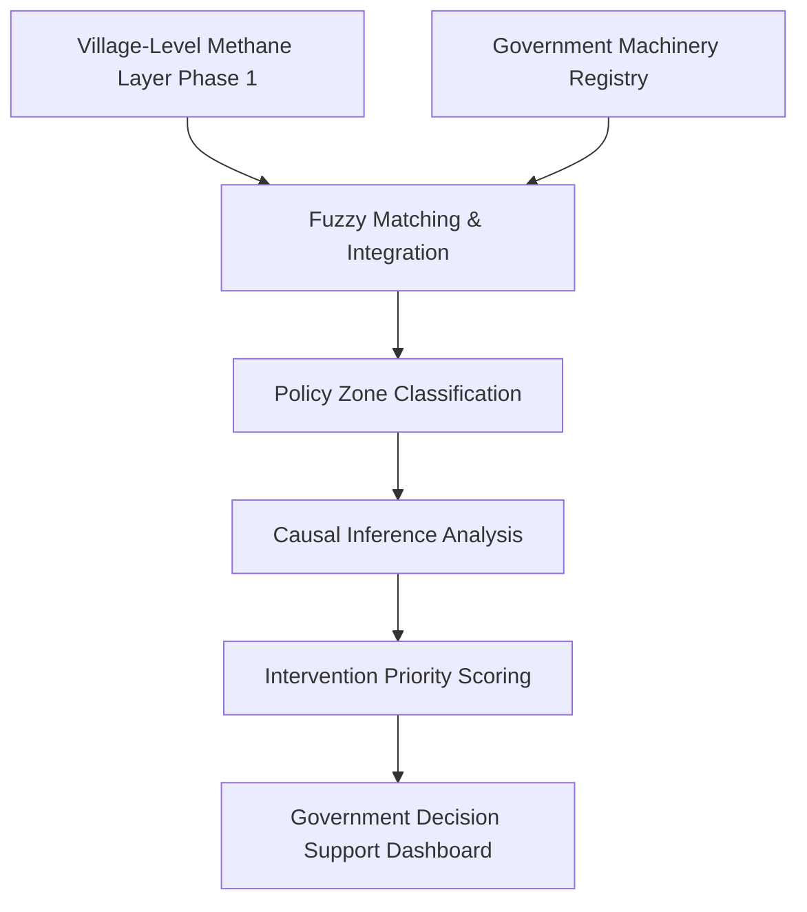

# Punjab Machinery Analytics

**Government Decision Support Dashboard**


---

## Executive Summary

The **Punjab Machinery Analytics** project is an advanced, production-ready Government Decision Support System. It integrates spatial environmental data with official government agricultural machinery records. 

By fusing:
- Village-level methane predictions (from Phase 1)
- CRM (Crop Residue Management) machinery records
- SMAM (Sub-Mission on Agricultural Mechanization) machinery records
- CDP (Crop Diversification Programme) machinery records
- Punjab village boundaries

This repository creates an interactive, bureaucratic-grade dashboard to evaluate whether government subsidies for stubble-clearing machinery are effectively reducing methane hotspots in Punjab.

---

## Results at a Glance

* **12,467** village polygons mapped.
* **21,796** machinery transactions processed and audited.
* **3,339** verified village-level machinery matches.
* Statistically significant inverse correlation observed between high In-Situ machinery density and methane emissions.
* Forensic Audit Status: **PASS** across all target leakage and robustness checks.

---

## Architecture



---

## Dashboard Layers

### Methane Layer
Visualizes the highly granular predicted CH₄ hotspots across Punjab.


### Machinery Layer
Visualizes the deployment density of In-Situ, Ex-Situ, and Prime Mover agricultural machinery.


### Policy Zones
Classifies every village into success/failure quadrants based on high/low machinery vs high/low methane.


### Priority Villages
Flags critical villages requiring immediate bureaucratic intervention.


---

## Statistical Results

The statistical validity of the policy interventions is documented through rigorous causal inference and density analysis.

### Treatment Intensity


### Density Quintiles


---

## Repository Structure

```text
Punjab_Machinery_Analytics/
├── data/           # Raw registries, matched data, and Phase 1 outputs
├── outputs/        # Generated dashboards, HTML reports, and charts
├── src/            # Core Python modules for analysis and merging
├── configs/        # Configuration files and path mappings
├── gee_layers/     # Google Earth Engine JavaScript scripts and geojson
├── audit/          # Forensic robustness and data-quality audit reports
└── docs/images/    # High-resolution presentation assets
```

---

## Methodology

1. **Village Mapping:** Generating a precise spatial layer of 12,467 Punjab villages.
2. **Machinery Integration:** Fuzzy matching and merging of 21,796 government machinery records to the village polygons.
3. **Density Normalization:** Adjusting machinery allocations against cultivated area and village size.
4. **Causal Inference:** Running OLS regression and SHAP impact analysis to evaluate scheme efficacy.
5. **Policy Classification:** Assigning each village to an actionable "Policy Zone".
6. **Forensic Audit:** Rigorous verification covering target leakage, spatial leakage, and government readiness.
7. **Dashboard Creation:** Development of interactive, map-based executive decision support systems.

---

## How to Run

1. **Clone the repository:**
   ```bash
   git clone https://github.com/Harshtech1/Punjab_Machinery_Analytics.git
   cd Punjab_Machinery_Analytics
   ```
2. **Install dependencies:**
   ```bash
   pip install -r requirements.txt
   ```
3. **Execute the full pipeline:**
   ```bash
   python main.py --step all
   ```
4. **Generate the offline HTML Dashboard:**
   ```bash
   python build_html_dashboard.py
   ```

---

## Government Applications

* **Subsidy Allocation Optimization:** Ensure future funding is directed to `Policy Failure Zones` exhibiting high CH₄ despite high machinery counts.
* **CRM Targeting:** Identify villages requiring urgent Crop Residue Management machinery.
* **Biomass Procurement Planning:** Optimize logistics for Ex-Situ balers based on proximity to hotspots and custom hiring centers.
* **Methane Hotspot Monitoring:** Track high-emission zones for targeted enforcement.

---

## Research Impact

This framework fundamentally shifts the analysis of agricultural subsidies from retrospective financial auditing to proactive, spatial-environmental efficacy tracking. It allows governments to see *exactly* where their budget is impacting the climate in real-time.

---

## Limitations

* **Machinery coverage = 26.8%:** Data represents a subset of total deployment.
* Results and correlations strictly represent **matched villages**.
* This is a **cross-sectional analysis** representing a specific temporal snapshot (2020).
* Associations and correlations presented in this study **do not imply causation**.

---

## Citation

If you utilize this framework or dashboard in your research or policy briefings, please cite:

> *Punjab Machinery Analytics: Government Decision Support System.* IIT Ropar, 2026.

---

## License

MIT License
