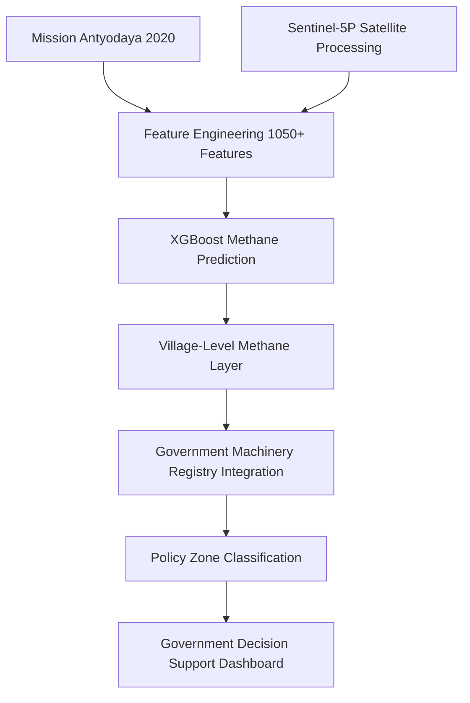

# Punjab Machinery Analytics

**Village-Level Agricultural Machinery Deployment, Methane Intelligence, and Decision Support Dashboard for Punjab**

---

## Executive Summary

The **Punjab Machinery Analytics** project provides an end-to-end framework for identifying agricultural methane emission hotspots and evaluating the efficacy of government machinery deployment.

* **Phase 1** generated precise village-level methane estimates using Sentinel-5P TROPOMI data integrated with the Mission Antyodaya 2020 infrastructure dataset, powered by an XGBoost model.
* **Phase 2** integrated raw government machinery deployment records (In-Situ, Ex-Situ, Prime Movers, and General) into the village-level methane layer.
* The project evaluates machinery allocation patterns against methane hotspots to quantify the real-world impact of subsidy schemes like CRM, SMAM, and CDP.
* The final output is a comprehensive **Government Decision Support Dashboard** designed for bureaucrats, policymakers, and ICAR scientists to optimize future interventions.

---

## Key Results

* **12,467** village polygons analyzed across Punjab.
* **3,339** verified machinery matches at the village level.
* **21,796** machinery transactions audited and categorized.
* **Target Leakage Audit:** ✅ PASS
* **Statistical Robustness Audit:** ✅ PASS
* **Dashboard Truthfulness Audit:** ✅ PASS

---

## Architecture



---

## Repository Structure

```text
Punjab_Machinery_Analytics/
├── data/           # Raw registries, matched data, and Phase 1 outputs
├── outputs/        # Generated dashboards, HTML reports, and charts
├── src/            # Core Python modules for analysis and merging
├── configs/        # Configuration files and path mappings
├── gee_layers/     # Google Earth Engine JavaScript scripts and geojson
└── audit/          # Forensic robustness and data-quality audit reports
```

*   `data/`: Houses the raw machinery registry and the Phase 1 prediction layer.
*   `outputs/`: Contains all visual analytics, causal inference charts, and the final HTML dashboard.
*   `src/`: Modularized Python pipeline for data merging, spatial analysis, and dashboard generation.
*   `configs/`: Centralized configurations.
*   `gee_layers/`: Earth Engine scripts (v1-v10) for cloud-based spatial visualization.
*   `audit/`: Exhaustive forensic reports guaranteeing the integrity and statistical validity of the findings.

---

## Methodology

1. **Satellite Processing:** Extraction of high-resolution methane readings (CH₄) using Sentinel-5P.
2. **Feature Engineering:** Creation of an extensive 1050+ feature matrix from Mission Antyodaya data.
3. **Machine Learning:** Training an XGBoost regressor to predict CH₄ hotspots based on village infrastructure and agricultural metrics.
4. **Village Mapping:** Generating a precise spatial layer of 12,467 Punjab villages.
5. **Machinery Integration:** Fuzzy matching and merging of 21,796 government machinery records to the village polygons.
6. **Forensic Audit:** Rigorous verification covering target leakage, spatial leakage, and government readiness.
7. **Dashboard Creation:** Development of interactive, map-based executive decision support systems (both local HTML and GEE).

---

## Dashboard Features

The final executive dashboard includes toggleable layers for:
* Methane Layer (Predicted CH₄ ppb)
* In-Situ Layer
* Ex-Situ Layer
* Prime Movers
* CRM (Crop Residue Management Scheme)
* SMAM (Sub-Mission on Agricultural Mechanization)
* CDP (Crop Diversification Programme)
* Scheme Score
* Policy Zones (Intervention Success, Policy Failure, Biomass Procurement, Baseline)
* Intervention Priority Index

---

## Audit Framework

To ensure the highest scientific rigor, the project is subjected to a comprehensive forensic audit framework:
* **Merge Audit:** Validates the fuzzy-matching logic between the registry and Antyodaya villages.
* **Coverage Audit:** Quantifies data availability and spatial representation.
* **Target Leakage Audit:** Ensures predictive models do not inadvertently train on future targets.
* **Spatial Leakage Audit:** Prevents geographical clustering bias in train/test splits.
* **Feature Stability Audit:** Monitors drift and correlation consistency across variables.
* **Government Readiness Audit:** Verifies that the final outputs are actionable and statistically sound for bureaucratic decision-making.

---

## Limitations

* **Machinery coverage = 26.8%:** Data represents a subset of total deployment.
* Results and correlations strictly represent **matched villages**.
* This is a **cross-sectional analysis** representing a specific temporal snapshot (2020).
* Associations and correlations presented in this study **do not imply causation**.

---

## Government Use Cases

* **CRM Targeting:** Identify villages requiring urgent Crop Residue Management machinery.
* **Biomass Procurement Planning:** Optimize logistics for Ex-Situ balers based on proximity to hotspots and custom hiring centers.
* **Methane Hotspot Monitoring:** Track high-emission zones for targeted enforcement and subsidy allocation.
* **Subsidy Allocation Optimization:** Ensure future funding is directed to `Policy Failure Zones` exhibiting high CH₄ despite high machinery counts.

---

## Installation

```bash
git clone https://github.com/Harshtech1/Punjab_Machinery_Analytics.git
cd Punjab_Machinery_Analytics
pip install -r requirements.txt
```

---

## Running the Pipeline

Execute the full end-to-end pipeline, or run specific steps:

```bash
# Run the forensic audit
python main.py --step audit

# Generate the HTML decision support dashboard
python build_html_dashboard.py
```

---

## Outputs

### Executive GEE Dashboard


### Policy Zones Classification


### Intervention Priority Villages


---

## Citation

If you utilize this framework or dashboard in your research or policy briefings, please cite:

> *Punjab Machinery Analytics: Village-Level Methane Intelligence & Decision Support Framework.* IIT Ropar, 2026.

---

## License

This project is licensed under the MIT License - see the LICENSE file for details.
